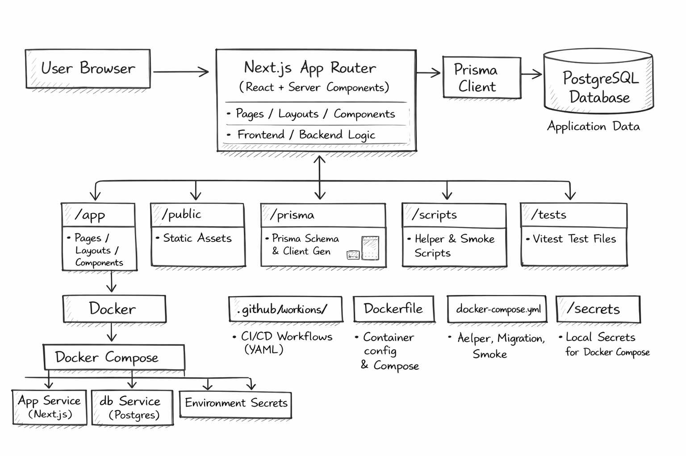

# Architecture Overview

This document describes the current project layout and runtime architecture. The repository is a Next.js application (App Router) that uses Prisma and PostgreSQL for persistence, and includes Docker tooling and GitHub Actions CI for testing and smoke checks.

Last updated: 2026-03-24

## 1. Project Structure (high level)

Top-level files and folders you will find in this repository:

- `app/` — Next.js App Router pages, layouts, and components (React)
- `public/` — static assets
- `prisma/` — Prisma schema and client generation
- `scripts/` — helper scripts and test smoke scripts (e.g., `scripts/test/smoke.js`)
- `secrets/` — example secret files used by `docker-compose` locally (not for production)
- `.github/workflows/` — GitHub Actions CI workflows (CI/CD, autograding)
- `Dockerfile`, `docker-compose.yml` — container and compose definitions for local/CI builds
- `tests/` — automated tests used by the classroom validator (Vitest)

This repository runs as a single Next.js app that talks to a Postgres database via Prisma. Docker Compose is provided for local integration testing and CI jobs.

## 2. High-Level System Diagram

Text diagram (simple):



Text version:

[User Browser] <--> [Next.js App Router (React, server components)] <--> [Prisma Client] <--> [PostgreSQL (db service)]

Notes:
- The Next.js app serves UI and may include server-side logic that runs during rendering (server components). Prisma is the DB access layer.
- Docker Compose wires the `app` service to a local `db` service for CI/local smoke checks.

## 3. Core Components

### 3.1. Frontend / App

Type: Next.js (App Router)

Technologies: Next.js, React, Tailwind CSS (project uses Tailwind), client + server components

### 3.2. Database & ORM

- Prisma schema is located at `prisma/schema.prisma` and the generated client is used by any server-side code.
- Primary DB: PostgreSQL (configured via `DATABASE_URL` or per-`POSTGRES_*` secrets).

### 3.3. Dev / Ops scripts

- `scripts/test/smoke.js` — lightweight smoke script used by CI to verify the environment
- `docker-entrypoint.sh` — reads secret files into environment variables and runs Prisma migrations / db push on container start
- `docker-compose.yml` — local compose environment for db + app with secrets mounting

## 4. Data Stores

### 4.1. Primary Database

Name: Application Database (Postgres)

Purpose: Stores application data such as users, sessions, and domain models defined in `prisma/schema.prisma`.

### 4.2. Local Secrets / Files

Local helper files are stored under `secrets/` for convenience in local/dev. These are **not** meant for production — use environment variables or a secret manager for production deployments. The `docker-entrypoint.sh` and `docker-compose.yml` read `secrets/*.txt` files and mount them into `/run/secrets/` within containers.

## 5. External Integrations / APIs

No explicit third-party integrations are visible in the repository listing. Typical candidates to add here if used:
- Stripe (payments)
- SendGrid / Mailgun (email)
- SSO providers (OAuth/OIDC)

Integration method: REST APIs or vendor SDKs.

## 6. Deployment & Infrastructure

### 6.1 GitHub Actions CI/CD

The repository includes a single consolidated CI pipeline (`.github/workflows/ci.yml`) that runs on every push to `main` and `develop`:

1. **Security Audit** — `npm audit` to surface vulnerabilities
2. **Build & Test** — lint, run tests (Vitest), smoke checks, and optional Docker+Postgres integration tests
3. **Setup EC2 Docker & Start App** — (runs on `main` only) SSHes to EC2, installs Docker if missing, pulls latest code, and restarts the app via `docker compose`

Required GitHub secrets for EC2 deployment:
- `EC2_HOST` — public IP or DNS of your EC2 instance
- `EC2_USER` — SSH user (e.g., `ubuntu`)
- `EC2_KEY` — private SSH key (PEM format)
- `EC2_PROJECT_PATH` — remote directory path (optional, defaults to `/home/ubuntu/app`)

### 6.2 Manual Deployment

For faster iteration, use the manual deploy script from your local machine:

```bash
EC2_HOST=<instance-ip> EC2_SSH_USER=ubuntu EC2_SSH_KEY=~/.ssh/HR.pem ./scripts/deploy-remote.sh
```

This script syncs your repo, installs Node/npm/pm2 if missing, runs `npm ci && npm run build`, and restarts the PM2 process.

### 6.3 Local Development

- `Dockerfile` and `docker-compose.yml` for building the app and running an integrated local stack
- Prisma migrations and schema generation are invoked in CI and via `docker-entrypoint.sh` when appropriate

## 7. Security Considerations

- Secrets: Do not commit files from `secrets/`. Use environment variables and a secrets manager for production.
- Transport: Use TLS for all external traffic in production.
- Authentication/Authorization: Not explicitly present. Recommended patterns: JWT or session cookies with CSRF protections for web routes; RBAC for internal permissions.
- Database credentials: Store in environment variables or secret store (e.g., AWS Secrets Manager, HashiCorp Vault).

## 8. Development & Testing Environment

Quick start (local):

1. Install Node.js and Docker.
2. PreEC2 Infrastructure

### 9.1 Instance Setup

- **OS:** Ubuntu Linux (t2.micro or similar)
- **Tools:** Docker, Docker Compose, PM2 (process manager), Node.js, Git
- **Networking:** Security group inbound rules allow SSH (port 22) and HTTP (port 80) from GitHub Actions and end users
- **App Port:** The Next.js app runs on port 3000 inside the container, exposed to port 80 on the host via Docker Compose

### 9.2 Deployment Flow

When you push to `main`:
1. GitHub Actions triggers the `ci.yml` workflow
2. After tests pass, the `setup-ec2-docker` job SSHes into EC2
3. It pulls the latest code from GitHub, builds the app, and restarts it via `docker compose up -d --build`

Alternatively (for faster feedback), run `./scripts/deploy-remote.sh` locally from your dev machine.

## 10. pare a local `./secrets/database_url.txt` for compose, e.g. `postgresql://postgres:postgres@db:5432/appdb`.
3. Start with Docker Compose:

```bash
docker compose up --build
```

Or run the app without Docker:

```bash
npm ci
npm run dev
```

Testing:

```bash
npm test
```

The project uses Vitest for the course tests located in `tests/`.

## 9. Future Considerations / Roadmap

- If the app grows, consider splitting UI and API into separate services (microservices) or deploying backend functions separately for better scaling.
- Add CI/CD pipelines, automated tests, and monitoring.
- Consider replacing plaintext `secrets/` usage with a proper secret management system.

## 10. Project Identification

Project: Next.js Portfolio Starter (classroom template)

Repository: https://github.com/LaunchPadPhilly/nextjs-portfolio-walkthrough-Nlewi-glitch089

Primary Contact: Project owner in repository (see Git history)

Date of Last Update: 2026-03-13

## 11. Glossary / Acronyms

Prisma: A modern ORM for Node.js and TypeScript.

SSR: Server-Side Rendering.

SSG: Static Site Generation.

DB: Database.

API: Application Programming Interface.

---

Notes and next steps:
- Add more specific component lists and diagrams as the codebase grows (draw a C4 diagram if helpful).
